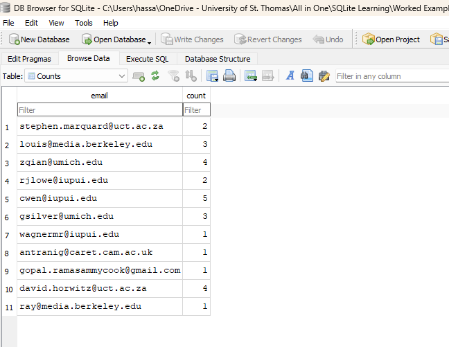
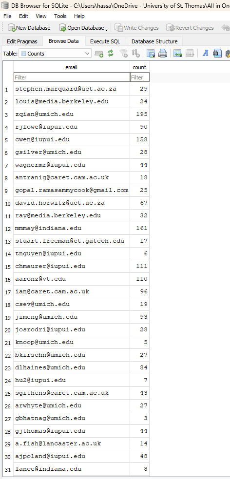

# SQLite Email Counter

A Python and SQLite project that parses email log data from a text file, extracts sender email addresses, counts how many times each email appears, stores the results in a SQLite database, and displays the top 10 most frequent senders.

---

## Project Overview

This project demonstrates how to:

- Read and process structured text data using Python
- Extract email addresses from log-style input files
- Store processed results in a SQLite database
- Perform SQL queries to retrieve sorted results
- Combine Python logic with SQL operations for data analysis

It is a simple but practical example of data parsing, database interaction, and query-based reporting.

---

## Technologies Used

- Python
- SQLite
- SQLite DB Browser
- SQL
- VS Code
- Jupyter NoteBook
- Git & GitHub

---

# Project Features

- Reads email log data from a text file  
- Extracts sender email addresses from lines starting with **From:**  
- Stores results in a SQLite3 database  
- Automatically inserts or updates email counts  
- Executes SQL queries to retrieve top email senders  
- Displays results sorted by frequency  

---

# How the Program Works

1. The program reads an email log file (`mbox-short.txt` or `mbox.txt`).
2. It scans each line and processes only lines beginning with **From:**.
3. The sender email address is extracted.
4. The program checks whether the email already exists in the SQLite table.
5. If the email exists, the count is increased.
6. If the email does not exist, it is inserted into the table.
7. Finally, an SQL query retrieves the **top 10 email addresses with the highest counts**.

Example SQL Query used:

```sql
SELECT email, count
FROM Counts
ORDER BY count DESC
LIMIT 10;
```

---

# Project Structure

```
sqlite-email-counter/
│
├── main.py
├── mbox-short.txt
├── mbox.txt
├── emaildb.sqlite
├── README.md
├── requirements.txt
└── .gitignore
```

---

# How to Run the Project

### 1. Clone the repository

```
git clone https://github.com/YOUR-USERNAME/sqlite-email-counter.git
```

---

### 2. Navigate to the project folder

```
cd sqlite-email-counter
```

---

### 3. Run the Python program

```
python main.py
```

---

### 4. Enter the file name

The program will ask:

```
Enter file name:
```

Press **Enter** to use the default file:

```
mbox-short.txt
```

or type:

```
mbox.txt
```

---

### 5. Program Output

The program will display the **Top 10 email addresses by frequency**.

Example output:

```
zqian@umich.edu 195
cwen@iupui.edu 158
mmmay@indiana.edu 161
chmaurer@iupui.edu 111
aaronz@vt.edu 110
```

---

# Database Structure

Table Name: **Counts**

| Column | Type |
|------|------|
| email | TEXT |
| count | INTEGER |

The database file generated by the program:

```
emaildb.sqlite
```

This file can be opened and explored using **DB Browser for SQLite**.

---

# SQLite Database Results

After running the program, the results are stored in the SQLite database and can be viewed in DB Browser for SQLite.

I have attached screenshots of the SQLite database results in this repository.

### Screenshot Files

- SQLite DB 1st Result.png  
- SQLite DB 2nd Result.png  

These screenshots show the stored email counts inside the SQLite database table.

---

# Screenshots

### SQLite Database Result 1



---

### SQLite Database Result 2



---

# Skills Demonstrated

- Python file handling
- Data parsing and extraction
- Relational database design
- SQL queries (SELECT, INSERT, UPDATE, ORDER BY, LIMIT)
- Python–SQLite integration
- Database analysis using DB Browser for SQLite
- Version control using Git and GitHub

---

# Author

**Syed Ahmed**

Master’s Student – Data Science  
University of St. Thomas
